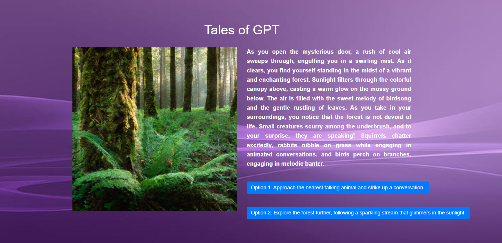
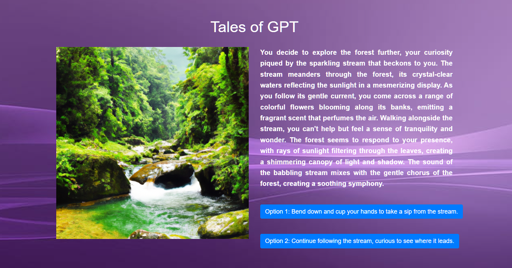
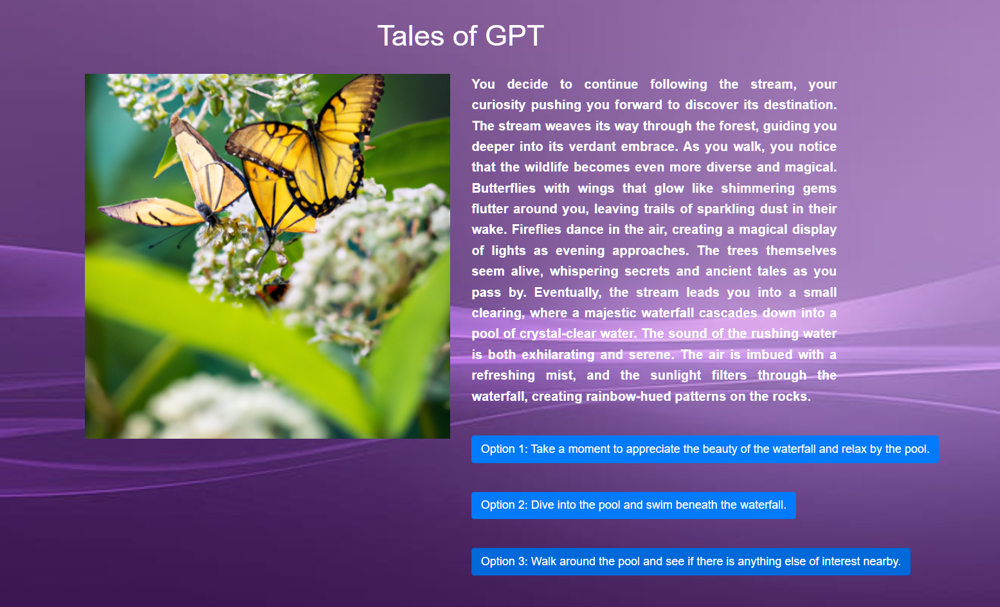
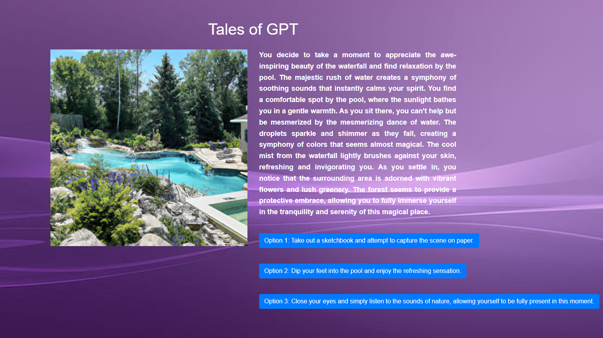

# TaleTinkerer

This project implements an interactive storytelling application powered by the OpenAI GPT-3.5 Turbo model. Users can engage with the application by making choices in a story, and the AI generates responses based on the given prompts.

|  |  |
|---------|---------|
|  |  |
|  |  |
